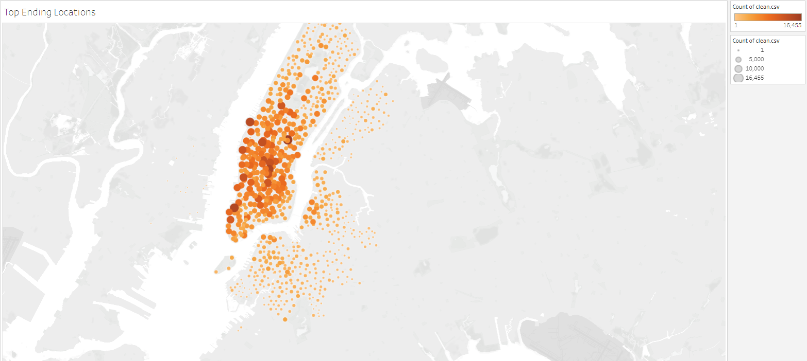
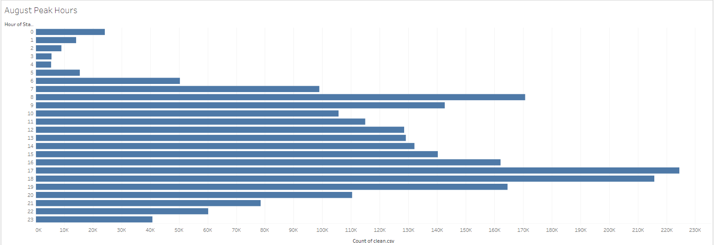

# Bike Sharing

## Overview of Project
Performing analysis on bike-sharing data in NYC in August 2019 to understand the potential of bike-share programs. 

## Analysis and Challenges
In order to understand the trip duration, we changed the "tripduration" column to a DateTime datatype and worked with clean data set.
## Results
[link to dashboard](https://public.tableau.com/views/Biketripanalysis/BikeTripAnalysis?:language=en-US&:display_count=n&:origin=viz_share_link)

- Checkout Times for Users- we can see that the trip duration of most of the users is less than an hour. Most of the user trip duration is 5 minutes.

- Checkout Times by Gender- the most trip-duration time for males and female is almost similar, 5 minutes for males and 6 for females.
 
- Trips by Weekday per Hour- We can see that Thursday evening is the most rush hour. The pick hours on workdays (Monday- Friday) are at the work commute time, 8 am and 5 pm-7 pm. Saturday's busy hours are between 10 am to 7 pm.
 
- Trips by Gender (Weekday per Hour)- when we look at the pick houres by gender, we can see that males are using the bike-sharing more than females during the work commute hours. 
.png)
- User Trips by Gender by Weekday- We can see that males have more subscribers than females and Thursday is the day that males use bike sharing the most.

 
- Top Ending Locations- are in Manhatten, and some of them are closer to downtown.

- August Peak Hours- are 5 pm and 6 pm. We can see that during the night 3 am and 4 am will be the best time to do maintenance for the bikes. 

